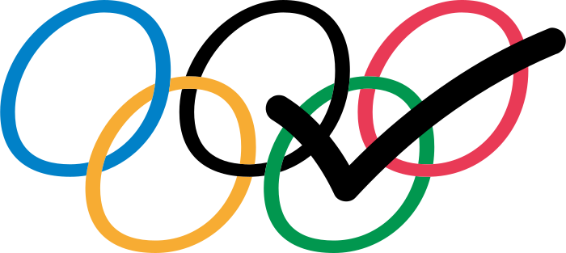

<h1>
<p align="center">
  
    <br>olympicks
</h1>
  <p align="center">
    <span>export 2024 summer olympic events to your calendar</span>
  </p>
</p>

Everything you need to build a Svelte project, powered by
[`create-svelte`](https://github.com/sveltejs/kit/tree/main/packages/create-svelte).

## development

olympicks is [sveltekit](https://kit.svelte.dev/) app.

```bash
pnpm install
pnpm dev
```
